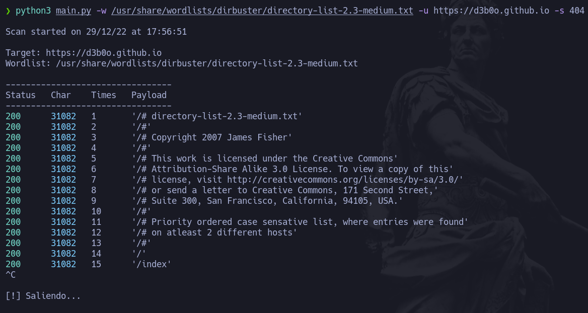

## ¿Que és?
Este programa es un script de exploración de directorios, también conocido como "directory buster". Se utiliza para buscar subdirectorios ocultos en un sitio web específico. El script toma dos argumentos obligatorios: una lista de palabras y una URL. Utiliza la lista de palabras como su diccionario y hace una solicitud HTTP GET a la URL con cada palabra en la lista como subdirectorio. Si la solicitud tiene éxito, es decir, si el servidor devuelve un código de estado HTTP 200, el subdirectorio se considera existente y se muestra en pantalla. Si el servidor devuelve un código de estado HTTP 404, significa que el subdirectorio no existe y se omite. Además, el script permite ignorar ciertos códigos de estado y subdirectorios con una cantidad específica de caracteres.

## ¿Como funciona?

El script comienza importando varias bibliotecas. La biblioteca "requests" se utiliza para hacer las solicitudes HTTP, la biblioteca "argparse" se utiliza para manejar los argumentos de la línea de comandos, la biblioteca "time" se utiliza para obtener la fecha y la hora actuales y la biblioteca "signal" se utiliza para manejar la señal de interrupción del sistema (CTRL + C).

Luego, se define una función "def_handler" que se ejecuta cuando se presiona CTRL + C. Esta función muestra el valor de la variable "times" (que luego se explicará) y sale del programa. A continuación, se configura la señal de interrupción del sistema para que utilice la función "def_handler" como manejador.

Luego, se define una función "parse_numbers" que convierte una cadena de números separados por comas en una lista de números. Esta función se utiliza para convertir los argumentos "-s" y "-c" en listas.

A continuación, se crea un objeto "parser" de la clase "ArgumentParser" y se definen los argumentos que puede tomar el script. El argumento "-w" o "--wordlist" es la ruta de la lista de palabras, el argumento "-u" o "--url" es la URL objetivo y los argumentos "-s" o "--status" y "-c" o "--characters" son listas opcionales de códigos de estado HTTP y cantidades de caracteres a ignorar, respectivamente.

Luego, se procesan los argumentos y se asignan a variables. La variable "wordlist" almacena la ruta de la lista de palabras, la variable "url" almacena la URL objetivo, la variable "invalid_status" almacena la lista de códigos de estado a ignorar y la variable "invalid_characters" almacena la lista de cantidades de caracteres a ignorar.

A continuación, se imprime un mensaje de inicio de exploración junto con la fecha y la hora actuales, la URL objetivo y la ruta de la lista de palabras. Luego, se imprime un encabezado para los resultados.

Luego, se define la función "main" que toma dos argumentos: la URL objetivo y la ruta de la lista de palabras. Dentro de la función, se crea una variable "times" inicializada en 0. Esta variable se utiliza para contar el número de palabras procesadas.

A continuación, se abre el archivo de la lista de palabras en modo de lectura y se itera sobre cada línea del archivo. Cada línea se almacena en la variable "word", se eliminan los espacios en blanco al principio y al final de la cadena y se asigna a una variable "test_url" que es la URL objettivo más la palabra actual. Luego, se realiza una solicitud GET a la URL "test_url" y se almacena la respuesta en la variable "response". Se crea una variable "content" que almacena el contenido de la respuesta.

A continuación, se verifica si el código de estado de la respuesta se encuentra en la lista de códigos de estado a ignorar o si la longitud del contenido se encuentra en la lista de cantidades de caracteres a ignorar. Si cualquiera de estas condiciones se cumple, se asigna a la variable "mostrar" el valor "False".

Si "mostrar" sigue siendo "True", se verifica el código de estado de la respuesta. Si el código de estado es 200, se imprime la línea en verde. Si el código de estado es 404, se imprime la línea en rojo. Si el código de estado es distinto a 200 o 404, se imprime la línea en amarillo.

Finalmente, se llama a la función "main" con la URL objetivo y la ruta de la lista de palabras como argumentos.
